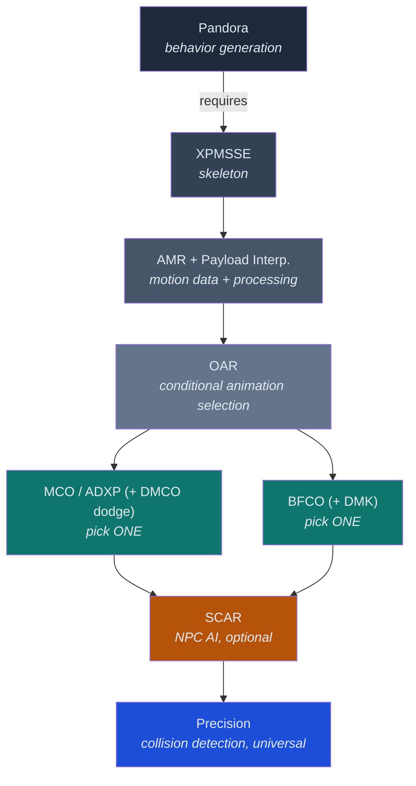

# Animations and Movement

**MO2 Separators:** `Animations - Framework`, `Animations - Movement & Idles`, `Animations - Combat`, `Animations - Interactions & Traversal`, `Animations - Creatures`

All mods in this section belong to one of the five animation separators as noted per subsection.

---

## Animation Framework Landscape — What Goes With What
Skyrim's animation stack has four distinct layers. Each layer has exactly one active owner. Understanding what replaces what, what depends on what, and what is mutually exclusive is the single most important prerequisite to building a stable animation load order.

### The Four Layers

| Layer                          | Role                                                                                                                                                                 | One Active    | Elder Wilds Pick                          |
|--------------------------------|----------------------------------------------------------------------------------------------------------------------------------------------------------------------|---------------|-------------------------------------------|
| **Behavior Engine**            | Generates behavior files from animation data. Runs as an external tool (MO2 executable).                                                                             | Yes           | Pandora                                   |
| **Conditional Replacer**       | Selects which `.hkx` file plays based on runtime conditions (weapon type, location, weather, NPC identity, etc.).                                                    | Yes           | OAR (Open Animation Replacer)             |
| **Combat Animation Framework** | Overhauls attack behavior: replaces vanilla attack chain logic with modern combo systems, enables motion-data-driven attacks, adds jumping/swimming/charged attacks. | Yes           | BFCO                                      |
| **NPC Combat AI**              | Teaches NPCs to use combat animation movesets intelligently — combo selection, distance management, attack commitment.                                               | None required | SCAR (Baseline after Precision is proven) |

### Behavior Engines

Behavior engines are the foundation. They read your installed animation mods, resolve conflicts between their behavior patches, and write out the final `behaviors` directory. You run them once after changing any animation mod that includes behavior data, and the output lives in a dedicated MO2 mod.

| Engine      | Status      | Creature Support          | Reads Nemesis Patches | Reads FNIS Formats | Notes                                                                                                                                                                                                                    |
|-------------|-------------|---------------------------|-----------------------|--------------------|--------------------------------------------------------------------------------------------------------------------------------------------------------------------------------------------------------------------------|
| **FNIS**    | Deprecated  | Limited (Add-on)          | No                    | Natively           | Closed source. Last meaningful update ~2016. No AE support. Do not use.                                                                                                                                                  |
| **Nemesis** | Superseded  | Partial (never completed) | Natively              | Partial            | Open source. Replaced FNIS around 2020. Creature support was a promised feature that never shipped. Still works on AE 1.6.1170 but Pandora is the direct upgrade.                                                        |
| **Pandora** | **Current** | Full                      | Yes                   | Yes                | Open source. Cross-platform. Error-tolerant (isolates illegal edits so one broken mod doesn't poison the whole patch). Faster generation. Reads both Nemesis patch format and legacy FNIS XML. **Elder Wilds baseline.** |

**Key compatibility rule:** Pandora replaces both FNIS and Nemesis. You do NOT install FNIS or Nemesis alongside Pandora. Most mods that say "Requires Nemesis" work under Pandora without modification — the Nemesis patch format is read natively. The rare exception is a hypothetical mod using a Nemesis-only code plugin that Pandora hasn't implemented, but this is essentially nonexistent in a modern AE load order.

Nemesis page lists "Project New Reign — Nemesis Unlimited Behavior Engine" at mod ID 60033 (the real page), NOT the various fork/translation pages that share the Nemesis name.

### Conditional Animation Replacers

Conditional replacers sit between the behavior engine output and the game engine. They don't generate behavior files — they decide which animation file to play at runtime based on configurable conditions.

| Replacer                             | Status           | Backward Compat                 | Open Source | Notes                                                                                                                                                                                                                               |
|--------------------------------------|------------------|---------------------------------|-------------|-------------------------------------------------------------------------------------------------------------------------------------------------------------------------------------------------------------------------------------|
| **DAR** (Dynamic Animation Replacer) | Maintenance-only | —                               | No (closed) | Author inactive. Works on AE 1.6.1170 but no new features expected. If DAR ever breaks from a future Skyrim update, nobody can fix it except the original author.                                                                   |
| **OAR** (Open Animation Replacer)    | **Current**      | Full DAR backward compatibility | Yes         | Implements every DAR condition. Adds: animation variants (random/sequential), presets (reusable condition blocks), in-game editor, constant polling, paired animation support, graph variable conditions. **Elder Wilds baseline.** |

**Key compatibility rule:** Any mod packaged for DAR works in OAR without modification. OAR reads DAR's folder structure and condition format natively. You do NOT need DAR installed alongside OAR — OAR is a complete replacement.

DAR-based mods use folder paths like `meshes\actors\character\animations\DynamicAnimationReplacer\_CustomConditions\...`. OAR reads these same folders with no conversion needed. Mod authors increasingly ship OAR-native configs (JSON-based, richer conditions) but DAR-format mods remain fully functional.

### Combat Animation Frameworks

Combat frameworks replace Skyrim's vanilla attack behavior — directional power attacks, combo chains, attack commitment, and motion-data-driven movement during swings. They are the layer that makes combat feel modern.

| Framework                                                                     | Requires                                                | Built-In Features                                                                                                                                                                            | Moveset Format            | Notes                                                                                                                                                                                                                                                               |
|-------------------------------------------------------------------------------|---------------------------------------------------------|----------------------------------------------------------------------------------------------------------------------------------------------------------------------------------------------|---------------------------|---------------------------------------------------------------------------------------------------------------------------------------------------------------------------------------------------------------------------------------------------------------------|
| **MCO / ADXP** (Modern Movement Combat Overhaul / Attack - Distar Experience) | AMR + Payload Interpreter + Pandora/Nemesis + OAR/DAR   | Directional power attacks (via separate mod), combo chains, motion-driven attacks                                                                                                            | `MCO_Attack*.hkx` naming  | Established standard. Vast moveset library. Active community. The "Distar ecosystem" includes MCO, DMCO (dodge), and related mods. Distar's mods have moved to Nexus (mod ID 117115 for the `.esp`; main files and movesets still reference the off-site download). |
| **BFCO** (Attack Behavior Framework)                                          | AMR + Payload Interpreter + DMK + Pandora/Nemesis + OAR | Directional power attacks (built-in, single hotkey), combo chains, motion-driven attacks, **jump attacks**, **swim attacks**, **charge attacks**, NPC combo AI (bfcoAI), gamepad MCM hotkeys | `BFCO_Attack*.hkx` naming | Newer alternative. More features packed into one framework. Has an MCO→BFCO converter tool for movesets. Mutually exclusive with MCO/SkySA/ABR.                                                                                                                     |

**Key compatibility rule: MCO and BFCO are mutually exclusive.** They perform the same function (attack behavior overhaul) and conflict on behavior files, power attack handling, and animation event processing. Pick one. Do not install both.

Both MCO and BFCO require **AMR** and **Payload Interpreter** as hard dependencies — these are not optional. BFCO does NOT eliminate the need for AMR; it lists AMR as a "must" requirement on its Nexus page. The shared dependency chain for either path is:

```
Pandora (behavior generation)
  + AMR (motion data in attacks)
  + Payload Interpreter (animation payload processing)
  + OAR (conditional animation selection)
  + XPMSSE (skeleton)
  + [MCO  OR  BFCO] (attack behavior framework)
```

BFCO also requires **Directional Movement Keys (DMK)** for directional power attacks to work correctly — this is unique to BFCO. MCO handles directional input through its own `.esp` and optional companion mods like "Separate Power Attacks."

**Moveset portability:** MCO movesets (.hkx files using `MCO_Attack*` naming) can be converted to BFCO format using the community "MCO To BFCO Converter" tool. The reverse (BFCO → MCO) is less common since BFCO has additional attack types (jump, swim) that have no MCO equivalent.

**Companion mods that BFCO replaces internally (do NOT install alongside BFCO):**

- One Click Power Attack NG / Elden Power Attack / For Honor Power Attack (power attack hotkey — BFCO has its own in MCM)
- Dual Wield Parrying (built into BFCO)
- UCBO — Unarmed Combat Behavior Overhaul (built into BFCO)
- One Handed Crossbow Framework (built into BFCO)
- CGO (conflicts — jump attacks cause stuck-in-falling state)

### NPC Combat AI

NPC combat AI teaches enemies to use combat animation movesets the way a player would — picking appropriate attacks based on range, committing to combos, and varying their patterns.

| Mod                                    | Requires                                                            | Works With            | Notes                                                                                                                                                                                                                                                          |
|----------------------------------------|---------------------------------------------------------------------|-----------------------|----------------------------------------------------------------------------------------------------------------------------------------------------------------------------------------------------------------------------------------------------------------|
| **SCAR** (Skyrim Combos AI Revolution) | Pandora/Nemesis + Address Library. AMR recommended (not mandatory). | MCO, BFCO, or vanilla | NPCs use SCAR-annotated animations via scarAI. With BFCO: SCAR annotations take priority; animations without SCAR annotations fall back to bfcoAI. With MCO: SCAR handles all NPC combo logic. **Elder Wilds baseline** (after Precision is confirmed stable). |

SCAR does NOT require AMR as a hard dependency (not listed in its Nexus requirements), but the two are designed to work together — AMR's motion data makes SCAR-driven NPC attacks feel grounded and weighty rather than ice-skating.

### Practical Compatibility Q&A

**Q: I have a DAR mod from 2021. Will it work with OAR?**
Yes. OAR implements every DAR condition and reads DAR folder structures natively. Install OAR, don't install DAR, and the DAR-packaged mod will work.

**Q: I have a mod that says "Requires Nemesis." Can I use Pandora instead?**
Yes, in virtually all cases. Pandora reads Nemesis patch format natively. The mod's Nemesis patch checkbox will appear in Pandora's UI just as it would in Nemesis.

**Q: Do I need FNIS for creature animations (e.g., werewolf, vampire lord)?**
No. Pandora has full creature support. FNIS is completely unnecessary in a modern AE load order.

**Q: I want to try BFCO instead of MCO. What do I need to change?**
Remove MCO and any MCO-specific movesets. Install BFCO, DMK, and BFCO-format movesets (or convert MCO movesets with the converter tool). Re-run Pandora, ticking BFCO's patch instead of MCO's. AMR, Payload Interpreter, OAR, and XPMSSE all stay — they're shared requirements.

**Q: Can I install SCAR without MCO or BFCO?**
Technically yes — SCAR has no hard dependency on either. But SCAR is designed to work with MCO/BFCO movesets, and without them NPCs can only use vanilla attack animations, which defeats the purpose. Always pair SCAR with a combat animation framework.

**Q: What about SkySA and ABR?**
Both are predecessors to MCO from the Distar ecosystem. SkySA was the original attack behavior mod; ABR was a fork. MCO superseded both. BFCO lists both as incompatible. Do not use either in a modern load order.

**Q: Does Precision (accurate melee collisions) work with all of this?**
Yes. Precision runs at the collision-detection layer, independent of which combat framework you choose. It works with MCO, BFCO, and vanilla. No special compatibility configuration needed.

### The Framework Dependency Map



### Research Findings (July 2026)

All four tasks researched. Sources: Nexus mod pages, Nexus community posts tabs, official patch compatibility statements.

**Task 1 — Pandora compatibility with modlist behavior mods**

Pandora v4.3.1 is confirmed compatible with all behavior-requiring mods currently in the Elder Wilds modlist. The BFCO author (BF001) explicitly tested and confirmed: *"I tested in Pandora v4.3.1 + Skeleton Auto Patch, everything works perfectly"* (BFCO sticky post, May 2024, updated for v3.100+). Pandora reads both Nemesis patch format and legacy FNIS XML natively — the only edge case identified is SCAR (see Task 3 below).

Behavior-requiring mods in the current modlist and their Pandora status:

| Mod | Has Pandora Patch | Notes |
|---|---|---|
| MCO/ADXP | Yes | Tick in Pandora UI. BFCO author confirmed Pandora works. |
| BFCO | Yes | Tick in Pandora UI. Author-tested with v4.3.1. |
| SCAR | Yes (requires fix) | Tick in Pandora. Also needs **[SCAR - Pandora - Fix](https://www.nexusmods.com/skyrimspecialedition/mods/164638)** loaded after SCAR. Without the fix: `WARN : Dispatcher > "SCAR" > defaultfemale~1hm_behavior > Replace > Element > #2521/event/Element0/id > FAILED`. |
| Animated Armoury OAR | Yes | Tick in Pandora for new weapon-type behaviors. |
| EVG Animated Traversal | Yes | Tick in Pandora. |
| SkyParkour | Yes | Tick in Pandora. |
| SkyClimb | Yes (if chosen) | Tick in Pandora. |
| XPMSSE | Yes (OR skip) | Do NOT tick the XPMSSE patch checkbox if using **Universal Behaviour Runtime — Auto Skeleton Patch** (mod 176724). The Auto Skeleton Patch replaces the old Pandora XPMSSE checkbox. |
| Precision | No patch needed | SKSE plugin only; no behavior generation. |
| AMR | No patch needed | SKSE plugin only; no behavior generation. |
| Payload Interpreter | No patch needed | SKSE plugin only; no behavior generation. |
| OAR | No patch needed | SKSE plugin only; no behavior generation. |
| IFrame Generator RE | No patch needed | SKSE plugin only; install only when a pack explicitly lists it. |

**Task 2 — MCO vs BFCO community signal on AE 1.6.1170 with Pandora**

Both frameworks are actively maintained and Pandora-compatible. The community signal divides along a clear line:

- **MCO** remains the established standard with the larger moveset library (hundreds of MCO-format animation packs). It is the proven path with the most community tutorials and troubleshooting resources. Distar's ecosystem (MCO, DMCO, related mods) is mature.
- **BFCO** is the rapidly growing alternative. Key advantages: built-in jump attacks, swim attacks, charge attacks, vanilla attack speed support, and gamepad MCM hotkey support — all features that MCO requires separate companion mods (or can't do) to achieve. BFCO v3.100+ is described by the author as "almost done with my idea," indicating maturity.

The **MCO→BFCO Converter** ([mod 119926](https://www.nexusmods.com/skyrimspecialedition/mods/119926), v1.2.2) is actively maintained and handles: file renaming, annotation conversion (attack speed, power windows, recovery, next-attack chaining, multi-window annotations), and batch processing. It converts `MCO_powerattackloop*.hkx` and `MCO_powerattackoutro*.hkx` files (supported since converter v1.2.1 / BFCO >= 3.3). The converter has gone through 10+ bugfix releases, with progressively better annotation fidelity.

BFCO also has a **BFCO NG** companion ([mod 160505](https://www.nexusmods.com/skyrimspecialedition/mods/160505)) for flexible hotkey assignment. BFCO's FOMOD offers pre-input behavior choices: "Vanilla Like" (can only input next attack after hit frame) vs "MCO Like" (can input next attack almost immediately — same feel as MCO).

**Recommendation:** BFCO is the better long-term fit for Elder Wilds given its built-in gamepad support, fewer companion-mods-required, and the converter making the MCO moveset library accessible. However, MCO remains a fully viable alternative. The decision can be deferred — either path works with Pandora and the rest of the stack.

**Task 3 — SCAR + Pandora interaction confirmed**

SCAR works with Pandora but needs the **SCAR - Pandora - Fix** ([mod 164638](https://www.nexusmods.com/skyrimspecialedition/mods/164638)). Requirements: Pandora Behaviour Engine Plus + SCAR AE Support. Install order: SCAR → SCAR AE Support → SCAR Pandora Fix. Then re-run Pandora.

Additional SCAR compatibility notes from community posts:
- If using **SCAR AE Support** ([mod 77285](https://www.nexusmods.com/skyrimspecialedition/mods/77285)) with BFCO: do NOT install the default animations in the SCAR AE Support FOMOD — they cause compatibility issues with BFCO.
- SCAR version 2.0 from GitHub (not the Nexus page) reportedly has issues with BFCO — stick to the Nexus version (v1.06b) for now.
- SCAR does not hard-require MCO; it works with MCO, BFCO, or SkySA/ABR. The SCAR Nexus comments explicitly state: *"You don't need MCO if you are using ABR or SkySA for this mod to work."*

**Task 4 — MCO→BFCO converter quality assessment**

The converter tool (v1.2.2) is actively maintained with good annotation fidelity but is not lossless. The changelog reveals the conversion has gone through multiple rounds of bugfixing:

- **v1.1.3:** Multi-window annotations fixed (animations with more than one `MCO_nextattack` or `MCO_PowerWinOpen` now convert correctly).
- **v1.1.4:** Added `MCO_powerWinOpen`/`MCO_powerWinClose` → BFCO annotation recognition.
- **v1.1.5:** Added attack speed annotation conversion (`MCO_AttackSpeed` → `BFCO_AttackSpeed`).
- **v1.1.6:** Old BFCO annotations are removed on re-conversion.
- **v1.2.1:** Power attack loop and outro files supported (`MCO_powerattackloop*.hkx`, `MCO_powerattackoutro*.hkx`).

Known limitations: the converter handles standard MCO annotations. MCO movesets with heavily custom or non-standard annotations may not convert perfectly. Complex movesets should be tested individually after conversion for: animation timing drift, ice-skating (lost motion data), missing combo-chain windows, and power attack trigger reliability.

**Risk assessment for the converter:** For the vast majority of MCO movesets with standard Distar-ecosystem annotations, the converter should produce clean BFCO output. Edge-case movesets with hand-tuned custom annotations are the primary risk. Given that Elder Wilds hasn't locked specific movesets yet, this is a manageable risk — verify each adopted moveset post-conversion rather than counting on batch-convert perfection.

---

## Pandora Framework And Prerequisites
| Mod                                                                                                             | Type     | Notes                                                                                                   |
|-----------------------------------------------------------------------------------------------------------------|----------|---------------------------------------------------------------------------------------------------------|
| [Pandora Behaviour Engine Plus](https://www.nexusmods.com/skyrimspecialedition/mods/133232)                     | Baseline | Single behavior-generation owner. Register as MO2 executable; output to dedicated `Pandora Output` mod. |
| [Universal Behaviour Runtime — Auto Skeleton Patch](https://www.nexusmods.com/skyrimspecialedition/mods/176724) | Baseline | Runtime skeleton patching for XPMSSE. Do NOT tick Pandora XPMSSE patch checkbox.                        |
| [A-Pose Bug Fix — Universal Behavior Runtime](https://www.nexusmods.com/skyrimspecialedition/mods/168903)       | Baseline | Runtime A-pose interception and LE animation backward compatibility.                                    |

### Risks & Compatibility

- Validate current Pandora install guide and requirements tab during setup.
- Leaving old generated output active or mixing generators makes debugging much harder.
- **SCAR compatibility:** SCAR triggers a known Pandora warning (`defaultfemale~1hm_behavior > Replace > Element > #2521`). Install **[SCAR - Pandora - Fix](https://www.nexusmods.com/skyrimspecialedition/mods/164638)** after SCAR + SCAR AE Support to resolve it. Re-run Pandora after adding.
- Do NOT tick the Pandora XPMSSE patch checkbox if **Universal Behaviour Runtime — Auto Skeleton Patch** is installed — they are mutually exclusive. The Auto Skeleton Patch is the preferred route.

---

## Skeleton And Behavior Prerequisites
| Mod                                                                                                         | Type        | Notes                                                            |
|-------------------------------------------------------------------------------------------------------------|-------------|------------------------------------------------------------------|
| [XP32 Maximum Skeleton Special Extended — XPMSSE](https://www.nexusmods.com/skyrimspecialedition/mods/1988) | Baseline    | Single skeleton baseline.                                        |
| [CBPC — Physics with Collisions](https://www.nexusmods.com/skyrimspecialedition/mods/21224)                 | Baseline    | Default first-pass physics for CBBE 3BA.                         |
| [FSMP — Faster HDT-SMP](https://www.nexusmods.com/skyrimspecialedition/mods/57339)                          | Baseline    | SMP coverage alongside CBPC. Required by OStim and some outfits. |
| [XPMSSE Fixed Scripts](https://www.nexusmods.com/skyrimspecialedition/mods/44252)                           | Alternative | Companion script fix over XPMSSE.                                |
| [ConsoleUtilSSE NG](https://www.nexusmods.com/skyrimspecialedition/mods/76649)                              | Alternative | Keep available for script-dependent pieces.                      |

---

## Parkour, Climbing, And Free-Form Movement
| Mod                                                                                                                            | Type        | Notes                                                                                     |
|--------------------------------------------------------------------------------------------------------------------------------|-------------|-------------------------------------------------------------------------------------------|
| [SkyParkour v3 - Procedural Parkour and Climbing Framework (SPPF)](https://www.nexusmods.com/skyrimspecialedition/mods/132292) | Baseline    | Vault, climb, traverse environmental geometry. 10,112 endorsements.                       |
| [EVG CLAMBER - Slope Animations](https://www.nexusmods.com/skyrimspecialedition/mods/114753)                                   | Baseline    | Character posture adjusts dynamically on slopes and stairs. Complements SkyParkour.       |
| [Feminine EVG Clamber Stair Animations](https://www.nexusmods.com/skyrimspecialedition/mods/148067)                            | Baseline    | Female-specific stair animations for EVG CLAMBER.                                         |
| [SkyClimb](https://www.nexusmods.com/skyrimspecialedition/mods/97253)                                                          | Alternative | Climbing-first alternative built around EVGAT. Pick one (not cumulative with SkyParkour). |
| Discipline-first route                                                                                                         | Alternative | Vanilla climbing + TDM + sprint/jump only.                                                |

### Horse Animation Candidates

| Mod | Type | Notes |
| --- | --- | --- |
| [Thundertrot Horse Animations](https://www.nexusmods.com/skyrimspecialedition/mods/140941) | Candidate | OAR-based horse movement/idle replacer. |
| [Horse Animation Overhaul (WIP - OAR)](https://www.nexusmods.com/skyrimspecialedition/mods/140122) | Candidate | Broader horse animation replacement. WIP — evaluate stability. |
| [Riding Animation Overhaul - RAO (OAR)](https://www.nexusmods.com/skyrimspecialedition/mods/102881) | Candidate | OAR-based horse riding animation replacer.                      |

All three are OAR-based and work under Pandora. Do not install together without verifying mutual compatibility.

### Companion Candidates (evaluate after baseline is locked)

- **Dova Jump** ([Nexus](https://www.nexusmods.com/skyrimspecialedition/mods/125550)) — Stamina-based jump height/distance. Complements parkour.
- **Walk Speed Tuner** ([Nexus](https://www.nexusmods.com/skyrimspecialedition/mods/179215)) — Configurable walk speed hotkey.
- **Beam Walking Assist** ([Nexus](https://www.nexusmods.com/skyrimspecialedition/mods/175511))
- **RaySense - Jumping over obstacles** ([Nexus](https://www.nexusmods.com/skyrimspecialedition/mods/175506))
- **RaySense - Edge Lookdown** ([Nexus](https://www.nexusmods.com/skyrimspecialedition/mods/175514))
- **Inertia - Physical Movement Response System** ([Nexus](https://www.nexusmods.com/skyrimspecialedition/mods/172783))

### Risks & Compatibility

- SkyClimb and SkyParkour are competing — not harmless companions.
- Parkour can expose navmesh gaps in older worldspaces.
- This subsection owns vertical/lateral movement; dodge, sprint, and camera belong in → `Third-Person`.

---

## Locomotion
| Mod                                                                                                                                                         | Type        | Notes                                                              |
|-------------------------------------------------------------------------------------------------------------------------------------------------------------|-------------|--------------------------------------------------------------------|
| [Leviathan Animations II - Male Idle Walk And Run](https://www.nexusmods.com/skyrimspecialedition/mods/81463)                                               | Baseline    | Male locomotion.                                                   |
| [Leviathan Animations II - Female Idle Walk And Run](https://www.nexusmods.com/skyrimspecialedition/mods/80760)                                             | Baseline    | Female locomotion.                                                 |
| [Vanargand Animations II - Male Idle Walk And Run](https://www.nexusmods.com/skyrimspecialedition/mods/99999)                                               | Alternative | Main male alternative.                                             |
| [Vanargand Animations II - Female Idle Walk And Run](https://www.nexusmods.com/skyrimspecialedition/mods/100000)                                            | Alternative | Main female alternative.                                           |
| [NPC Animation Remix (OAR)](https://www.nexusmods.com/skyrimspecialedition/mods/63471)                                                                      | Alternative | NPC-specific movement and idle animation remix.                    |
| [Arm Movement Animations (OAR)](https://www.nexusmods.com/skyrimspecialedition/mods/62849)                                                                  | Alternative | Hand and arm idle animation variations.                            |
| [Conditional Armor Type Animations](https://www.nexusmods.com/skyrimspecialedition/mods/51507)                                                              | Alternative | Add after base locomotion is accepted.                             |
| [Dynamic Female Weather Idles](https://www.nexusmods.com/skyrimspecialedition/mods/98493)                                                                   | Alternative | OAR-based weather-aware idles. Complements survival/weather stack. |
| [EVG Animated Traversal](https://www.nexusmods.com/skyrimspecialedition/mods/63232)                                                                         | Alternative | Belongs in interaction/traversal bucket.                           |
| [Goetia Animations - Female Idle Walk And Run](https://www.nexusmods.com/skyrimspecialedition/mods/68005)                 | Alternative | Female locomotion animation pack.                                  |
| [Goetia Animations - Male Idle Walk And Run](https://www.nexusmods.com/skyrimspecialedition/mods/68625)                   | Alternative | Male locomotion animation pack.                                    |
| [Poser Hotkeys Plus SSE](https://www.nexusmods.com/skyrimspecialedition/mods/17743)                                                                       | Alternative | Hotkey-based pose/idle system.                                      |
| [More Tavern Idles - SSE Port](https://www.nexusmods.com/skyrimspecialedition/mods/16757)                                                                 | Alternative | Tavern-specific idle animation variety.                             |
| [Lightweight Headtracking and Emotions](https://www.nexusmods.com/skyrimspecialedition/mods/224)                                                           | Alternative | NPC/PCP headtracking and expression support.                        |
| [Smooth Random Jump Animation - Rework](https://www.nexusmods.com/skyrimspecialedition/mods/59633)                                                         | Alternative     | Randomized jump animation replacer.                                 |
| [Smooth Weapon Jump Animation](https://www.nexusmods.com/skyrimspecialedition/mods/74748)                                                                  | Alternative     | Weapon-drawn jump animation replacer.                               |
| [Random Swimming Animations](https://www.nexusmods.com/skyrimspecialedition/mods/92951)                                                                    | Alternative     | Randomized swimming animation replacer.                             |
| [Dynamic Sprint](https://www.nexusmods.com/skyrimspecialedition/mods/95561)                                                                                | Alternative     | SKSE-based sprint animation with motion-matched lean.               |
| [Dynamic Sprint Stop](https://www.nexusmods.com/skyrimspecialedition/mods/107057)                                                                          | Alternative     | Sprint-stop animation with deceleration. Companion to Dynamic Sprint. |
| [Vanargand Animations - Sneak idle walk and run](https://www.nexusmods.com/skyrimspecialedition/mods/54351)                                                | Alternative     | Sneak locomotion animation pack.                                    |

---

## Combat Animation Packs
| Mod                                                                                                                                                                         | Type            | Notes                                                                                                                                      |
|-----------------------------------------------------------------------------------------------------------------------------------------------------------------------------|-----------------|--------------------------------------------------------------------------------------------------------------------------------------------|
| [Precision - Accurate Melee Collisions](https://www.nexusmods.com/skyrimspecialedition/mods/72347)                                                                          | Baseline        | Accurate melee collision detection.                                                                                                        |
| [SCAR - Skyrim Combos AI Revolution](https://www.nexusmods.com/skyrimspecialedition/mods/72014)                                                                             | Baseline        | Add after Precision is proven. Companion mods: [SCAR AE Support](https://www.nexusmods.com/skyrimspecialedition/mods/77285) + [SCAR Pandora Fix](https://www.nexusmods.com/skyrimspecialedition/mods/164638). If using BFCO, skip default animations in SCAR AE FOMOD. |
| [Animated Armoury - OAR](https://www.nexusmods.com/skyrimspecialedition/mods/103577)                                                                                        | Baseline        | 12 new weapon types. Requires [DAR Version](https://www.nexusmods.com/skyrimspecialedition/mods/35978) for meshes/collision/leveled lists. Tick in Pandora for new weapon behaviors. |
| [No Spinning Death Animation LITE](https://www.nexusmods.com/skyrimspecialedition/mods/33597)                                                                               | Baseline        | Prevents spinning death animations.                                                                                                        |
| [MCO ADXP - Modern Movement Combat Overhaul](https://www.nexusmods.com/skyrimspecialedition/mods/117115)                                                                    | High-Commitment | System-level decision. Evaluate later.                                                                                                     |
| [Animation Motion Revolution](https://www.nexusmods.com/skyrimspecialedition/mods/50258) + [Payload Interpreter](https://www.nexusmods.com/skyrimspecialedition/mods/65089) | High-Commitment | Required MCO support.                                                                                                                      |
| [IFrame Generator RE AE Support](https://www.nexusmods.com/skyrimspecialedition/mods/82737)                                                                                 | Support         | Install only when a pack explicitly lists it.                                                                                              |
| [BFCO - Attack Behavior Framework](https://www.nexusmods.com/skyrimspecialedition/mods/117052)                                                                              | High-Commitment | System-level framework competing with MCO/ADXP. Mutually exclusive. Requires [DMK](https://www.nexusmods.com/skyrimspecialedition/mods/174499) for directional power attacks. Confirmed working with Pandora v4.3.1. Companion: [BFCO NG](https://www.nexusmods.com/skyrimspecialedition/mods/160505) for flexible hotkeys. |
| [Elden Ring DLC Light Greatsword Moveset](https://www.nexusmods.com/skyrimspecialedition/mods/122800)                                                                       | Alternative     | Requires MCO or BFCO framework. 1H and 2H moveset.                                                                                         |
| [Vindictus Fiona Moveset BFCO](https://www.nexusmods.com/skyrimspecialedition/mods/183971)                                                                                  | Alternative     | BFCO-specific moveset. Requires BFCO framework.                                                                                            |
| [Vindictus Delia Animation Remake](https://www.nexusmods.com/skyrimspecialedition/mods/104717)                                                                              | Alternative     | Combat animation pack.                                                                                                                     |
| [MCO / BFCO / SCAR WoLong QuarterStaffs](https://www.nexusmods.com/skyrimspecialedition/mods/128749)                                                                        | Alternative     | Works with MCO, BFCO, or SCAR. Quarterstaff moveset.                                                                                       |
| [Dynamic Killmove - Pike](https://www.nexusmods.com/skyrimspecialedition/mods/103707)                                                                       | Alternative     | Killmove animation for pike/spear weapons.                                                                                                 |
| [KG Animations - One-handers and Dual Wield](https://www.nexusmods.com/skyrimspecialedition/mods/129519)                                                  | Alternative     | One-handed and dual-wield combat animation pack.                                                                                           |
| [KG Animations - Two-handers](https://www.nexusmods.com/skyrimspecialedition/mods/101541)                                                                  | Alternative     | Two-handed combat animation pack.                                                                                                          |
| [Smooth Random Blocking Animation 3.0](https://www.nexusmods.com/skyrimspecialedition/mods/59239)                                                          | Alternative     | Randomized blocking animation replacer.                                                                                                    |
| [Precision - Enchanted Weapon Trails](https://www.nexusmods.com/skyrimspecialedition/mods/106358)                                                          | Alternative     | Weapon trail VFX requiring Precision.                                                                                                      |
| [Killmove Fixes](https://www.nexusmods.com/skyrimspecialedition/mods/140398)                                                                                | Alternative     | Killmove trigger and camera fixes.                                                                                                         |
| [Goetia Animations - Magic Spell Casting](https://www.nexusmods.com/skyrimspecialedition/mods/70204)                                                       | Alternative     | Magic spell casting animation replacer.                                                                                                    |
| [Diverse NPC Movesets](https://www.nexusmods.com/skyrimspecialedition/mods/141893)                                                                          | Alternative     | Varied NPC combat stances via SCAR/OAR.                                                                                                    |
| [For Honor in Skyrim](https://www.nexusmods.com/skyrimspecialedition/mods/151478)                                                                                           | High-Commitment | Comprehensive combat overhaul. Competing with MCO/BFCO and Valhalla.                                                                       |
| [Vanargand Animations - Sneak Strike Attacks](https://www.nexusmods.com/skyrimspecialedition/mods/55420)                                                                 | Alternative     | Sneak power-attack animation replacer.                                                                                                     |
| [Vanargand Animations - Sneak Thrust Attacks](https://www.nexusmods.com/skyrimspecialedition/mods/55031)                                                                 | Alternative     | Sneak thrust-attack animation replacer.                                                                                                    |
| [Vanargand Animations - Archery](https://www.nexusmods.com/skyrimspecialedition/mods/60323)                                                                              | Alternative     | Archery draw-and-release animation replacer.                                                                                              |
| [Vanargand Animations - Sneak Archery](https://www.nexusmods.com/skyrimspecialedition/mods/56788)                                                                        | Alternative     | Sneak archery stance and release animation replacer.                                                                                       |
| [Vanargand Animations - Dual Wield Sneak Strikes](https://www.nexusmods.com/skyrimspecialedition/mods/64216)                                                             | Alternative     | Dual-wield sneak attack animation replacer.                                                                                                |
| [Vanargand Animations - Crossbows](https://www.nexusmods.com/skyrimspecialedition/mods/66286)                                                                            | Alternative     | Crossbow draw-and-fire animation replacer.                                                                                                 |
| [Vanargand Animations - Sneak Crossbows](https://www.nexusmods.com/skyrimspecialedition/mods/67282)                                                                      | Alternative     | Sneak crossbow stance and fire animation replacer.                                                                                         |
| [Goetia Animations - Sneak Magic](https://www.nexusmods.com/skyrimspecialedition/mods/75482)                                                                             | Alternative     | Sneak magic-casting animation replacer.                                                                                                    |
| [Goetia Animations - Conditional Shouts](https://www.nexusmods.com/skyrimspecialedition/mods/76388)                                                                      | Alternative     | Conditional shout animation replacer.                                                                                                      |
| [Dynamic Dodge Animation](https://www.nexusmods.com/skyrimspecialedition/mods/79598)                                                                                     | Alternative     | SKSE-based dodge animation with i-frames. DMCO-compatible.                                                                                 |

---

## ADXP/MCO Install Workflow Reference
External tutorial baseline: [Capt. Panda — STEP BY STEP GUIDE on How to Install ADXP MCO for Skyrim SE and AE (MO2)](https://www.youtube.com/watch?v=YeS6Pwnv3b8). Captures the canonical ADXP/MCO install flow; references below use the Elder Wilds stack (Pandora for behaviour generation, OAR for conditional selection).

### Tutorial Mod List — Elder Wilds Status

| Mod                                                                | Tutorial role             | Elder Wilds status                                                                                         |
|--------------------------------------------------------------------|---------------------------|------------------------------------------------------------------------------------------------------------|
| ADXP / MCO — Modern Movement Combat Overhaul (`modding-guild.com`) | Core combat overhaul      | Listed in `Combat Animation Packs` as High-Commitment; adoption is a system-level decision, not a drop-in. |
| Animation Motion Revolution (AMR)                                  | MCO motion support        | Listed in `Combat Animation Packs`.                                                                        |
| Payload Interpreter                                                | AMR dependency            | Listed in `Combat Animation Packs`.                                                                        |
| Separate Power Attacks (reza9892, AE build)                        | Power-attack input scheme | Not yet adopted. Nexus page requires verification before listing.                                          |
| ADXP/MCO — Valhalla Nordic Animation Reworked (Very Mingming)      | Recommended moveset       | Not yet adopted. Nexus page requires verification before listing.                                          |
| Elden Ring Inspired Movesets (Black)                               | Recommended moveset       | Not yet adopted. Nexus page requires verification before listing.                                          |

### Install Flow (Pandora/OAR)

1. Download ADXP/MCO, AMR, and Payload Interpreter from their canonical pages; match SE vs AE builds to the Skyrim build (Elder Wilds targets AE 1.6.1170).
2. In MO2, group these under the `Animations - Combat` separator (3-dot menu → Create separator). Order between the three is not load-order-sensitive.
3. Install ADXP/MCO, Animation Motion Revolution, and Payload Interpreter as separate MO2 mods.
4. Open Animation Replacer covers conditional selection across the whole stack (→ `Conditional Animation Systems`).
5. Optionally install a moveset (Very Mingming's Valhalla Nordic, or Black's Elden Ring Inspired) under `Animations - Combat` — only after its Nexus page has been verified.
6. Create a dedicated empty MO2 mod named `Pandora Output` to receive generated behaviour files (→ `Pandora Framework And Prerequisites`).
7. Configure Pandora to write into `Pandora Output` (set output target to that empty mod, not to overwrite).
8. In Pandora, tick ADXP/MCO, Payload Interpreter, and any power-attack mod once adopted. Tick every other behaviour-requiring mod present in the load order.
9. Run Pandora: Update Engine → Launch. Keep antivirus off during generation; re-enable afterwards.
10. On generation error, exit Pandora, reopen, repeat Update Engine → Launch.
11. Launch Skyrim and verify: separate power-attack input and weapon-sheathe behaviour intact.

### Risks & Compatibility

- The tutorial's `Separate Power Attacks` choice overrides one-click/`custom OCPA`. Third-person gamepad parity depends on the bound input (see → `Third-Person Gameplay`) and has not yet been evaluated.
- The IFrame Generator entry in `Combat Animation Packs` is only relevant when a pack explicitly lists it — do not install speculatively.

### Acceptance Criteria

- ADXP/MCO, AMR, and Payload Interpreter install cleanly under `Animations - Combat`.
- Pandora generation completes with ADXP/MCO and Payload Interpreter ticked; output lands in `Pandora Output`.
- Power-attack and weapon-sheathe inputs work end-to-end in third-person gamepad, validated against → `Third-Person Gameplay`.
- Any added moveset or power-attack mod has its Nexus page verified before being formally added to `Combat Animation Packs`.

### Research Tasks

- Verify Nexus pages for `Separate Power Attacks` (reza9892), `ADXP/MCO — Valhalla Nordic Animation Reworked` (Very Mingming), and `Elden Ring Inspired Movesets` (Black). The tutorial's description links are truncated and these mods are not currently in the modlist.
- Cross-check `r/skyrimmods` signal for ADXP/MCO on AE 1.6.1170 with Pandora before locking or removing the High-Commitment stamp.
- Confirm the `Separate Power Attacks` input scheme's behaviour in third-person gamepad (potential collision with dodge or block inputs) before adoption.

---

## Non-Combat Interaction Animations
| Mod                                                                                                                                   | Type        | Notes                                                              |
|---------------------------------------------------------------------------------------------------------------------------------------|-------------|--------------------------------------------------------------------|
| [Immersive Interactions - Animated Actions](https://www.nexusmods.com/skyrimspecialedition/mods/47670)                                | Baseline    | Core interaction animation framework.                              |
| [Go to bed](https://www.nexusmods.com/skyrimspecialedition/mods/4224)                                                                 | Baseline    | Bed interaction animations.                                        |
| [Animated Interactions SKSE](https://www.nexusmods.com/skyrimspecialedition/mods/143798)                                              | Alternative | Can coexist only if overlapping actions are deliberately disabled. |
| [Take a Seat](https://www.nexusmods.com/skyrimspecialedition/mods/54193)                                                              | Alternative | Sitting interaction animations.                                    |
| [Immersive Hunting Animations](https://www.nexusmods.com/skyrimspecialedition/mods/96961)                                             | Alternative | Hunting-related animations.                                        |
| [Immersive Carcass Carrying](https://www.nexusmods.com/skyrimspecialedition/mods/99867)                                               | Alternative | Carcass carrying animations.                                       |
| [Flute Animation Fix](https://www.nexusmods.com/skyrimspecialedition/mods/69609)                                                      | Alternative | Flute playing animation fix.                                       |
| [Witcher Flute](https://www.nexusmods.com/skyrimspecialedition/mods/144660)                                                           | Alternative | Witcher-style flute animation.                                     |
| [EVG Animated Traversal](https://www.nexusmods.com/skyrimspecialedition/mods/63232)                                                   | Alternative | Environment traversal animations.                                  |
| [Beginner Bard Animations](https://www.nexusmods.com/skyrimspecialedition/mods/130776)                                                | Alternative | For Skyrim's Got Talent.                                           |
| [Immersive Interactions - Eating ingredients and apply poison animations](https://www.nexusmods.com/skyrimspecialedition/mods/117983) | Add-on      | Eating and poison-apply animations for II.                         |
| [Dynamic Crafting Animations](https://www.nexusmods.com/skyrimspecialedition/mods/116422)                                             | Add-on      | Crafting-station interaction animations.                           |
| [Dynamic Looting and Harvesting Animations](https://www.nexusmods.com/skyrimspecialedition/mods/114547)                               | Add-on      | Looting and harvesting interaction animations.                     |
| [Dynamic Horse Petting Animations for Immersive Interactions](https://www.nexusmods.com/skyrimspecialedition/mods/111767)             | Add-on      | Horse interaction animations for II.                               |
| [Tools Not Weapons (Pickaxe and Woodcutter Axe) DAR Animations](https://www.nexusmods.com/skyrimspecialedition/mods/70117)            | Prerequisite | DAR/OAR animations for mining/chopping tools. Prerequisite for Chop Chop and related woodcutting mods. |
| [HSF Male Furniture Idles](https://www.nexusmods.com/skyrimspecialedition/mods/155228)                                                | Alternative | Male idle animations for furniture interactions.                   |
| [Modern Female Sitting Animations Overhaul](https://www.nexusmods.com/skyrimspecialedition/mods/85599)                                | Alternative | Female sitting animation replacements.                             |
| [Paired Animation Improvements](https://www.nexusmods.com/skyrimspecialedition/mods/99621)                                            | Alternative | Improved paired NPC interaction animations.                             |
| [Ultimate Animated Potions NG](https://www.nexusmods.com/skyrimspecialedition/mods/97674)                                            | Alternative | Potion-use animation replacer.                                          |
| [JellyFish Ultimate Animated Potions NG](https://www.nexusmods.com/skyrimspecialedition/mods/168108)                                  | Alternative | Expanded potion animation pack for Ultimate Animated Potions NG.        |
| [Simple Wall Lean (RaySense)](https://www.nexusmods.com/skyrimspecialedition/mods/176847)                                            | Alternative | Contextual wall-leaning idle animation.                                 |
| [Simple Wall Lean - More feminine Female animations](https://www.nexusmods.com/skyrimspecialedition/mods/182365)                     | Add-on      | Female-specific variant for Simple Wall Lean.                           |
| [Divines Prayer Animations](https://www.nexusmods.com/skyrimspecialedition/mods/109175)                                              | Alternative | Conditional prayer-idle animation at shrine activations.                |
| [Gesture Animation Remix (OAR)](https://www.nexusmods.com/skyrimspecialedition/mods/64420)                                           | Alternative | Expanded gesture/idle animation variety via OAR.                        |
| [Lively Children Animations (OAR)](https://www.nexusmods.com/skyrimspecialedition/mods/67557)                                        | Alternative | Child NPC animation variety for play/idle/run.                          |
| [Lively cart driver animation replacer or OAR](https://www.nexusmods.com/skyrimspecialedition/mods/70595)                            | Alternative | Cart driver animation replacer for carriage rides.                      |

---

## Conditional Animation Systems
| Mod                                                                                                      | Type        | Notes                                                         |
|----------------------------------------------------------------------------------------------------------|-------------|---------------------------------------------------------------|
| [Open Animation Replacer](https://www.nexusmods.com/skyrimspecialedition/mods/92109)                     | Baseline    | Single condition framework owner.                             |
| [EVG Conditional Idles](https://www.nexusmods.com/skyrimspecialedition/mods/34006)                       | Alternative | Idle animation conditional framework.                         |
| [Conditional Armor Type Animations](https://www.nexusmods.com/skyrimspecialedition/mods/51507)           | Alternative | Armor-type-based animation switching.                         |
| [Unique Jarl Throne Sitting Animation (OAR)](https://www.nexusmods.com/skyrimspecialedition/mods/174752) | Alternative | Throne sitting animation for Jarls.                           |
| [Malignis Animations - Conditions](https://www.nexusmods.com/skyrimspecialedition/mods/132028)           | Alternative | OAR condition pack for animation variety. Personal favourite. |

---

## Camera-Aware Animation Support
| Mod                                                                                                                | Notes                                           |
|--------------------------------------------------------------------------------------------------------------------|-------------------------------------------------|
| [Improved Camera SE](https://www.nexusmods.com/skyrimspecialedition/mods/93962)                                    | Only if hybrid perspective is a real playstyle. |
| [Comprehensive First Person Animation Overhaul - CFPAO](https://www.nexusmods.com/skyrimspecialedition/mods/87169) | Optional first-person polish.                   |

---

## Equipment Display Framework
Equipment visibility, sheathing positions, and draw-sheathe animations. Builds on XPMSSE for third-person gamepad parity.

| Mod                                                                                                                  | Type        | Notes                                                                                           |
|----------------------------------------------------------------------------------------------------------------------|-------------|-------------------------------------------------------------------------------------------------|
| [Immersive Equipment Displays (IED)](https://www.nexusmods.com/skyrimspecialedition/mods/62001)                      | Baseline    | Equipment visibility and positioning framework.                                                 |
| [Simple Dual Sheath](https://www.nexusmods.com/skyrimspecialedition/mods/50049)                                      | Baseline    | Dual-sheathed weapon support. Requires IED.                                                     |
| [Weapon Styles - Draw-Sheathe animations for IED](https://www.nexusmods.com/skyrimspecialedition/mods/85085)         | Addon       | Conditional draw/sheathe animations per weapon type. Requires IED.                              |
| [Walking Stick - Walk with staves or polearms - IED-OAR](https://www.nexusmods.com/skyrimspecialedition/mods/120966) | Addon       | Staff/polearm walking animation support. Requires IED.                                          |
| [Ready to Play IED](https://www.nexusmods.com/skyrimspecialedition/mods/158531)                                      | Alternative | Pre-configured IED preset. Evaluate only if manual IED configuration proves too time-consuming. |
| [Weapons On Back](https://www.nexusmods.com/skyrimspecialedition/mods/14997)                                        | Alternative | Weapon positioning on back rather than hip. Complements IED/SDS. |

---

## Creature Animations
| Mod                                                                                            | Notes                                          |
|------------------------------------------------------------------------------------------------|------------------------------------------------|
| [New Creature Animation - Giant](https://www.nexusmods.com/skyrimspecialedition/mods/83317)    | Giant animation replacer.                      |
| [New Creature Animation - Werewolf](https://www.nexusmods.com/skyrimspecialedition/mods/83806) | Werewolf animation replacer.                   |
| [New Creature Animation - Falmer](https://www.nexusmods.com/skyrimspecialedition/mods/83572)   | Falmer animation replacer.                     |
| [DCA - Dragon Combat Animations](https://www.nexusmods.com/skyrimspecialedition/mods/123113)   | Dragon combat animation replacer.              |
| [Draugr Greatsword Animation](https://www.nexusmods.com/skyrimspecialedition/mods/114721)      | Greatsword-wielding draugr animation replacer. |
| [Troll - MCO](https://www.nexusmods.com/skyrimspecialedition/mods/175250)                     | Troll combat animation replacer (requires MCO). |

### Risks & Compatibility

- Validate per-pack combat-animation support individually. Keep layer small and intentional.

---

## Animation Conflict Management
Strict ownership: one clear owner per layer.

### Owners

- **Behavior generation:** Pandora only
- **Skeleton:** XPMSSE only
- **Conditional selection:** Open Animation Replacer only

### Workflow

- Keep Pandora output isolated in dedicated MO2 output mod.
- Record which mods rely on generation, which on OAR, and which are pure presentation.
- Test in repeatable scenarios: town walking, idle downtime, dungeon corridors, uneven outdoor combat, interaction-heavy interiors, creature encounters.

### Risks & Compatibility

- Animation conflicts look like camera, combat, or skeleton bugs until ownership is checked.
- Mixed generated output hides whether a problem is from load order or stale behavior files.

---

## Open Research

Open research for the animations stack is tracked in `TODO.md`.
