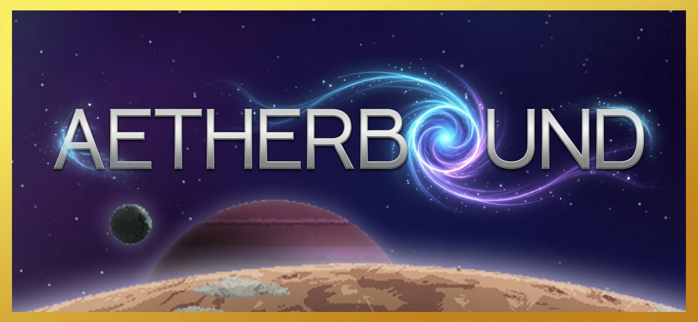

<p align="center">
  
</p>

# Aetherbound

A curated, beginner-friendly modlist guide for **Starbound 1.4.4** using **SBMM (Starbound Mod Manager)**.

## Philosophy

Aetherbound is built for players who want a richer Starbound experience without losing the soul of the original game. Two waves guide you from complete beginner to seasoned explorer.

**Target version: 1.4.4 (August 7, 2019)** — every mod in this list is verified compatible.

### What's Included

- Bugfixes to smooth out 1.4.4 issues
- QoL/UI improvements that preserve vanilla balance
- Expanded content — new races, quests, planets, biomes, mechanics, weapons, ships
- Enhanced graphics — parallax, lighting, planet backgrounds
- Tasteful adult content where thematically appropriate
- Professional PDF guide with full installation instructions

### What's NOT Included

- Cheats or overpowered mods
- Pornographic content
- Mods incompatible with 1.4.x
- Redundant or conflicting mods

## Waves

| Wave | Name | Experience | Mods | Guide |
|------|------|-----------|------|-------|
| **0** | First Steps | New player | QoL/UI only | Complete how-to-play guide |
| **1** | Beyond the Horizon | Completed vanilla story | 9 categories | Strategy and advanced topics |

## Prerequisites

- **Starbound 1.4.4** (Steam)
- **SBMM (Starbound Mod Manager)** by korsir — GitHub (URL TBC)
- **Typst 0.15.0+** — `winget install Typst.Typst`

## Quick Start

1. Install Typst: `winget install Typst.Typst`
2. Clone this repo and navigate to `starbound/`
3. Build the guide: `./tools/build.ps1`
4. Read `output/aetherbound.pdf`
5. Follow the installation guide in the PDF to set up SBMM and install mods

## Building the PDF

```powershell
./tools/build.ps1
```

Output: `output/aetherbound.pdf`

## Project Structure

```
starbound/
├── guide/          # All guide content (Typst .typ files)
├── templates/      # Typst PDF template
├── tools/          # Build scripts
├── output/         # Generated PDF
├── conflicts.md    # Known mod conflicts (reference only)
├── mod-ideas.md    # Future mod development ideas
└── STATUS.md       # Development decisions and notes
```

## License

This guide is for personal use. Mods are property of their respective authors. Space Grotesk and Inter fonts are SIL Open Font License.
